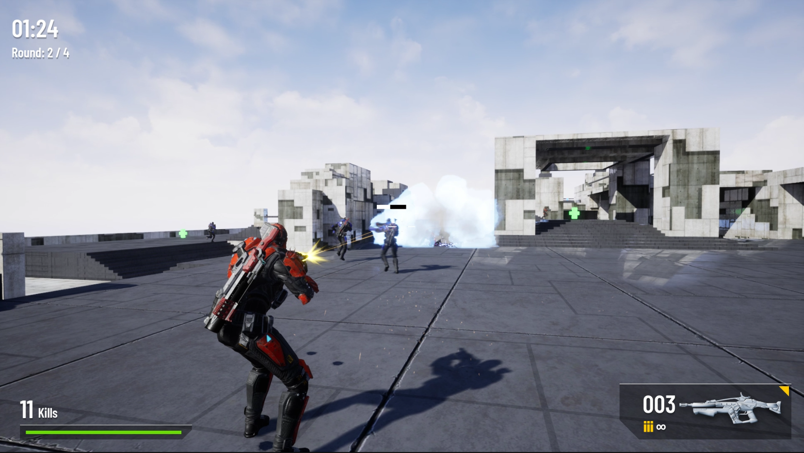

# ShootThemUp Game

A third-person shooter game with gloomy atmosphere developed in C++ featuring advanced AI powered by behavior trees, multiple rounds, diverse maps, and various pickups.

## Game building

To successfully build and run this game locally, the following soft will be required:

- Unreal Engine 4.26 or uppper
- Visual Studio 2019
- .NET

